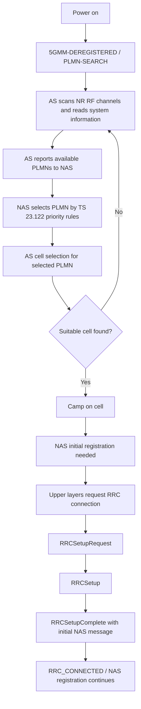

# 5G UE 开机后搜网流程分析报告

## 1. 结论摘要

- 5G UE 开机后的“搜网”不是单一 RRC 流程，而是 NAS 与 AS 协同：NAS 负责 PLMN selection，AS/RRC 负责 available PLMN search 与 cell selection，后续再由 NAS 初始注册触发 RRC establishment。
- NAS 层 PLMN selection 的主规范是 3GPP TS 23.122；开机或失覆盖恢复场景主要对应 clause 4.4.3.1，自动选网优先级主要对应 clause 4.4.3.1.1。
- AS/RRC 层小区选择的主规范是 3GPP TS 38.304；它规定 RRC_IDLE/RRC_INACTIVE 下 UE 的 available PLMN search、cell selection、cell reselection 和 camping 行为。
- AS 可以扫描 NR RF channels、读取系统信息并向 NAS 上报 available PLMNs，但 selected PLMN 是 NAS 根据 TS 23.122 选择的结果。
- NAS 选定 PLMN 后，AS 才执行 cell selection，为该 selected PLMN 找 suitable cell 并 camp on cell。
- RRC establishment 的主规范是 3GPP TS 38.331 clause 5.3.3；它发生在 UE 已经 camp on suitable cell、upper layers 请求建立 RRC connection 之后。
- RRC connection establishment 建立 SRB1，并用于通过 RRCSetupComplete 承载 initial NAS dedicated information/message，但它不等同于 NAS 注册完成。

## 2. 研究范围与问题拆解

本次研究覆盖 5G UE 开机后，从搜网到初始接入前半段的分层流程：

- NAS 层 PLMN selection：UE 选择哪个 PLMN。
- AS/RRC 层 available PLMN search：AS 扫频、读系统信息、向 NAS 上报候选 PLMN。
- AS/RRC 层 cell selection：在 selected PLMN 下选择 suitable cell 并驻留。
- 后续 RRC establishment：从 RRC_IDLE 进入 RRC_CONNECTED，并承载初始 NAS 消息。

本次不覆盖：

- 完整 NAS Registration procedure 的所有鉴权、安全、Registration Accept/Complete 细节。
- CR/TDoc 历史溯源。
- SNPN、CAG、NTN、RedCap、sidelink 等专题增强的完整分支。
- 物理层同步、SSB/PBCH 具体搜索算法和 RF 性能要求的实现细节。

问题类型：

- 协议流程分析。
- clause 解释。
- NAS/AS/RRC 分层边界澄清。

## 3. 规范依据

| 功能 / 子问题 | 主要规范或资料 | 作用 | 证据状态 |
| --- | --- | --- | --- |
| PLMN selection | 3GPP TS 23.122 v19.6.0 | NAS idle mode 网络选择规则 | confirmed |
| AS/NAS 分工 | 3GPP TS 38.304 v19.2.0 | 定义 RRC_IDLE/RRC_INACTIVE 下 AS 与 NAS 分工 | confirmed |
| Available PLMN search | 3GPP TS 38.304 v19.2.0 | AS 扫描 NR 频点、读取 PLMN identity 并上报 NAS | confirmed |
| Cell selection | 3GPP TS 38.304 v19.2.0 | suitable cell、acceptable cell、S criterion 和 camping | confirmed |
| RRC connection establishment | 3GPP TS 38.331 v19.2.0 | RRCSetupRequest/RRCSetup/RRCSetupComplete 流程 | confirmed |
| Initial registration 触发 | 3GPP TS 24.501 v19.6.2 | 5GMM-DEREGISTERED、PLMN-SEARCH、NORMAL-SERVICE 和 initial registration 行为 | confirmed |

版本核对来源：

- TS 23.122 Portal: https://portal.3gpp.org/desktopmodules/Specifications/SpecificationDetails.aspx?specificationId=789
- TS 38.304 Portal: https://portal.3gpp.org/desktopmodules/Specifications/SpecificationDetails.aspx?specificationId=3192
- TS 38.331 Portal: https://portal.3gpp.org/desktopmodules/Specifications/SpecificationDetails.aspx?specificationId=3197
- TS 24.501 Portal: https://portal.3gpp.org/desktopmodules/Specifications/SpecificationDetails.aspx?specificationId=3370

## 4. 分阶段分析

### 4.1 开机与 5GMM/PLMN-SEARCH

输入条件：

- UE power on。
- N1 mode 可用。
- USIM 或订阅数据有效。

核心过程：

- TS 24.501 描述 UE 开机后进入 5GMM-DEREGISTERED。
- 在开机后的 substate selection 中，若 USIM 可用且有效，UE 进入 PLMN-SEARCH。
- PLMN-SEARCH 表示 UE 正在搜索 PLMN/SNPN；当 cell 被选中后，UE 会进入 NORMAL-SERVICE 或 LIMITED-SERVICE，若没有可选 cell，则进入 NO-CELL-AVAILABLE。

输出状态：

- UE 开始 PLMN search / cell search 的协同过程。

相关规范：

- TS 24.501 clause 5.1.3.2.1.2。
- TS 24.501 clause 5.2.2.2.1。

证据编号：

- E006。

### 4.2 NAS 层 PLMN selection

输入条件：

- 开机或从失覆盖中恢复。
- UE 已有 USIM/ME 中的 PLMN selector、forbidden PLMN、EHPLMN、RPLMN 等信息。
- AS 可向 NAS 报告 available PLMNs。

核心过程：

- TS 23.122 clause 4.4.3.1 规定 switch-on 或 recovery from lack of coverage 的 PLMN selection。
- UE 优先尝试 registered PLMN 或 equivalent PLMN；如果不可用或注册失败，则根据自动或手动模式执行对应流程。
- 自动模式下，TS 23.122 clause 4.4.3.1.1 的核心顺序包括：
  - HPLMN 或最高优先级 EHPLMN。
  - User Controlled PLMN Selector with Access Technology 中的 PLMN/access technology combination。
  - Operator Controlled PLMN Selector with Access Technology 中的 PLMN/access technology combination。
  - 其他 high quality signal 的 PLMN/access technology combination。
  - 其他按 signal quality 递减排序的 PLMN/access technology combination。

输出状态：

- NAS 选择出 selected PLMN。
- 如果 successful registration achieved，则当前 serving PLMN 成为 registered PLMN。

相关规范：

- TS 23.122 clause 4.4.3。
- TS 23.122 clause 4.4.3.1。
- TS 23.122 clause 4.4.3.1.1。

证据编号：

- E001。
- E002。

### 4.3 AS/RRC 层 available PLMN search

输入条件：

- NAS 请求 AS 搜索 available PLMNs，或 AS 可自主上报。
- UE 支持相关 NR bands。

核心过程：

- TS 38.304 clause 5.1.1.1 规定：on request of NAS, AS shall perform a search for available PLMNs and report them to NAS。
- TS 38.304 clause 5.1.1.2 规定 NR case：UE 扫描其能力支持的 NR bands 中所有 RF channels；在每个 carrier 上搜索 strongest cell，并读取 system information，以确定该 cell 属于哪些 PLMN/CAG。
- 如果读到 PLMN identities 且满足 NR high-quality criterion，即 RSRP >= -110 dBm，则作为 high quality PLMN 上报 NAS；如果不满足但能读到 PLMN identity，也可带 RSRP 上报 NAS。

输出状态：

- NAS 获得 available PLMNs、可能的 CAG 信息和质量信息。
- NAS 根据 TS 23.122 继续执行 PLMN selection。

相关规范：

- TS 38.304 clause 5.1.1.1。
- TS 38.304 clause 5.1.1.2。

证据编号：

- E003。

### 4.4 AS/RRC 层 cell selection

输入条件：

- NAS 已选择 selected PLMN。
- AS 获得 RAT 指示、equivalent PLMN list、forbidden registration area 等 NAS 信息。

核心过程：

- TS 38.304 general description 明确：UE switched on 时，PLMN/SNPN 由 NAS 选择；NAS 向 AS 提供 equivalent PLMN/SNPN list。
- TS 38.304 clause 5.1.1.2 明确：once UE has selected a PLMN, the cell selection procedure shall be performed in order to select a suitable cell of that PLMN to camp on。
- TS 38.304 clause 5.2.3.1 定义两种 cell selection：
  - Initial cell selection：没有先验 RF channel 信息时，UE 扫描所有支持的 NR RF channels，找到 suitable cell 后选择该 cell。
  - Stored information based cell selection：利用历史频点、小区参数或测量控制信息；若找不到 suitable cell，则回退 initial cell selection。
- TS 38.304 clause 5.2.3.2 定义 cell selection criterion S：

```text
Srxlev > 0 AND Squal > 0
```

- suitable cell 还需要满足 selected/registered/equivalent PLMN 关系、cell not barred、tracking area 不在 forbidden list、RAT 未被限制等条件。

输出状态：

- UE camp on suitable cell。
- UE 可接收系统信息、注册区信息、paging/notification，并可发起 transfer to Connected mode。

相关规范：

- TS 38.304 clause 4。
- TS 38.304 clause 4.5。
- TS 38.304 clause 5.2.3.1。
- TS 38.304 clause 5.2.3.2。

证据编号：

- E004。

### 4.5 NAS initial registration 与 RRC establishment 的衔接

输入条件：

- UE 已 camp on suitable cell。
- UE 在 5GMM-DEREGISTERED.NORMAL-SERVICE。
- NAS 需要执行 initial registration。

核心过程：

- TS 24.501 规定，在 5GMM-DEREGISTERED 中，若要建立 5GMM context，UE 启动 initial registration procedure。
- TS 24.501 clause 5.2.2.3.1 规定 UE 在 NORMAL-SERVICE 下应发起 initial registration procedure，除非受 timer T3346 等限制。
- NAS 的 Registration Request 是 initial NAS message；TS 24.501 定义 initial NAS message 可触发 N1 NAS signalling connection establishment。
- 为承载初始 NAS 消息，upper layers 请求 RRC 建链。

输出状态：

- RRC layer 开始 RRC connection establishment。

相关规范：

- TS 24.501 clause 5.1.3.2.1.2。
- TS 24.501 clause 5.2.2.3.1。

证据编号：

- E006。

### 4.6 后续 RRC connection establishment

输入条件：

- UE 在 RRC_IDLE。
- UE 已获得 essential system information。
- Upper layers 请求建立 RRC connection。

核心过程：

- TS 38.331 clause 5.3.3.1 规定 RRC connection establishment 的目的：建立 RRC connection，涉及 SRB1 establishment，并用于传输 initial NAS dedicated information/message。
- TS 38.331 clause 5.3.3.2 规定 UE 在 RRC_IDLE 且已获得 essential system information 时，根据 upper layers 请求发起 RRC establishment。
- UE 启动 T300，发送 RRCSetupRequest。
- 网络返回 RRCSetup。
- UE 收到 RRCSetup 后进入 RRC_CONNECTED，停止 cell reselection procedure，将当前 cell 视为 PCell，构造并发送 RRCSetupComplete。
- RRCSetupComplete 中包含 dedicatedNAS-Message，该字段携带 upper layers 提供的 NAS 信息。

典型消息链：

```text
UE -> gNB: RRCSetupRequest
gNB -> UE: RRCSetup
UE -> gNB: RRCSetupComplete(dedicatedNAS-Message = Registration Request 等初始 NAS 消息)
```

输出状态：

- UE 进入 RRC_CONNECTED。
- SRB1 已建立。
- 初始 NAS 注册消息被送入网络，后续 NAS registration 继续进行。

相关规范：

- TS 38.331 clause 5.3.3.1。
- TS 38.331 clause 5.3.3.2。
- TS 38.331 clause 5.3.3.3。
- TS 38.331 clause 5.3.3.4。

证据编号：

- E005。

## 5. 证据链表

| id | claim | source_type | source_id | version_or_release | clause_or_section | evidence_summary | status |
| --- | --- | --- | --- | --- | --- | --- | --- |
| E001 | NAS 层 PLMN selection 由 TS 23.122 规定 | TS | TS 23.122 | v19.6.0 / Rel-19 | 4.4.3, 4.4.3.1 | TS 23.122 是 NAS functions related to MS in idle mode；规定开机/失覆盖恢复时 PLMN selection | confirmed |
| E002 | 自动 PLMN selection 有明确优先级顺序 | TS | TS 23.122 | v19.6.0 / Rel-19 | 4.4.3.1.1 | 自动模式按 HPLMN/EHPLMN、User Controlled、Operator Controlled、high quality signal、其他 signal quality 等顺序选择 | confirmed |
| E003 | AS 负责搜索 available PLMNs 并向 NAS 报告 | TS | TS 38.304 | v19.2.0 / Rel-19 | 5.1.1.1, 5.1.1.2 | AS 根据 NAS 请求扫描 NR RF channels、读取系统信息、上报 PLMN identities 和质量信息 | confirmed |
| E004 | NAS 选择 PLMN 后，AS 进行 cell selection 选择 suitable cell | TS | TS 38.304 | v19.2.0 / Rel-19 | 4, 4.5, 5.2.3.1, 5.2.3.2 | TS 38.304 定义 suitable cell、acceptable cell、initial/stored cell selection 和 S criterion | confirmed |
| E005 | RRC establishment 建立 SRB1 并承载 initial NAS message | TS | TS 38.331 | v19.2.0 / Rel-19 | 5.3.3.1-5.3.3.4 | RRC connection establishment 包含 RRCSetupRequest、RRCSetup、RRCSetupComplete，RRCSetupComplete 携带 dedicatedNAS-Message | confirmed |
| E006 | 开机后 UE 进入 PLMN-SEARCH，并在 NORMAL-SERVICE 下发起 initial registration | TS | TS 24.501 | v19.6.2 / Rel-19 | 5.1.3.2.1.2, 5.2.2.2.1, 5.2.2.3.1 | TS 24.501 描述 5GMM-DEREGISTERED、PLMN-SEARCH、NORMAL-SERVICE 和 initial registration 触发 | confirmed |

## 6. 图示



## 7. 常见误区

- 把 PLMN selection 等同于 cell selection。PLMN selection 是 NAS 选择运营商网络；cell selection 是 AS 在 selected PLMN 下找可驻留小区。
- 把 AS 搜索 available PLMNs 误认为 AS 决定 selected PLMN。AS 负责扫描、读取系统信息、上报候选；最终 selected PLMN 由 NAS 决定。
- 把 cell selection 与 RRC establishment 混为一谈。cell selection 发生在 RRC_IDLE/RRC_INACTIVE 下，目标是 camp on cell；RRC establishment 是从 RRC_IDLE 进入 RRC_CONNECTED。
- 把 RRC establishment 等同于注册完成。RRCSetupComplete 可携带 Registration Request 等初始 NAS 消息，但 NAS 注册还需要鉴权、安全、Registration Accept/Complete 等后续流程。
- 忽略 limited service。找不到 suitable cell 时，UE 可能 camp on acceptable cell 以获得 emergency/ETWS/CMAS 等 limited service。

## 8. 未确认点与后续核验建议

| 未确认点 | 为什么未确认 | 后续应查 |
| --- | --- | --- |
| Rel-15 到 Rel-19 中 PLMN/cell selection 的演进差异 | 本次只核对当前 Rel-19 规范，没有追溯 CR | TS 23.122、38.304、38.331 相关 CR/TDoc |
| SNPN、CAG、NTN、RedCap 对开机搜网的完整影响 | 本次聚焦普通 PLMN 场景，未展开专题分支 | TS 23.122、38.304、24.501 中 SNPN/CAG/NTN/RedCap clauses |
| 物理层同步和 SSB 搜索实现细节 | 本次研究边界是 NAS/AS/RRC 协议流程，不覆盖 PHY 算法 | TS 38.213、38.215、38.133、38.101 |
| 具体 UE vendor 的优化策略 | 规范允许 UE 在部分搜索顺序、存储信息使用、多 RAT 优先级上有实现空间 | UE vendor implementation note、conformance test、field log |

## 9. 可复用总结

5G UE 开机搜网可理解为三段式流程。第一段是 NAS 层 PLMN selection：UE 在 5GMM-DEREGISTERED/PLMN-SEARCH 中，由 NAS 根据 TS 23.122 中的 RPLMN/EHPLMN/HPLMN、用户/运营商 PLMN selector、forbidden lists 和信号质量等规则选择 selected PLMN。第二段是 AS/RRC 层 cell selection：AS 根据 TS 38.304 扫描 NR 频点、读取系统信息、向 NAS 上报 available PLMNs，并在 NAS 选定 PLMN 后寻找 suitable cell；满足 Srxlev/Squal、PLMN、barred、TA 与 RAT restriction 等条件后，UE camp on cell。第三段是 RRC establishment：当 NAS 需要 initial registration 时，上层请求 RRC 建链，UE 按 TS 38.331 clause 5.3.3 发送 RRCSetupRequest，接收 RRCSetup，并通过 RRCSetupComplete 携带 initial NAS message 进入 RRC_CONNECTED，后续 NAS registration 继续完成。
