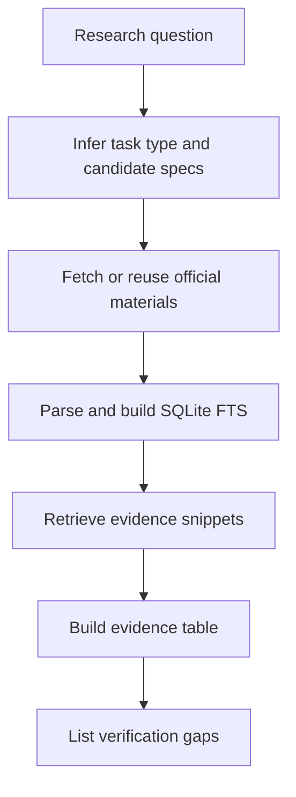

# {{question}} 深度研究报告

> 本报告由 `3gpp-research-kit research` 生成。它是证据优先的深度研究草案：只把已检索到官方 URL 或本地可追溯来源的内容列为 confirmed/evidence-grounded；CR、TDoc、Meeting Report 覆盖不足时，相关结论保持待核验。

## 1. 结论摘要

{{summary_bullets}}

## 2. 研究范围与问题拆解

- 研究问题：{{question}}
- 任务类型：{{task_type}}
- 候选 TS/TR：{{specs}}
- 本次下载动作：{{downloaded}}
- 工具编排计划：{{tool_plan_summary}}
- 覆盖范围：本地 incoming 资料、已解析文本、SQLite FTS 检索库和基础关系表。
- 排除范围：未被下载或导入的 CR/TDoc/Meeting Report、未解析成功的 PDF/扫描件、厂商实现差异和外场日志。

## 3. 规范依据

| 功能 / 子问题 | 主要规范或资料 | 作用 | 证据状态 |
| --- | --- | --- | --- |
{{source_inventory_rows}}

## 4. Evidence Table / 证据表

| id | claim | source_type | source_id | version_or_release | clause_or_section | evidence_summary | quote_or_pointer | status |
| --- | --- | --- | --- | --- | --- | --- | --- | --- |
{{evidence_table_rows}}

## 5. 分主题分析

### 5.1 直接证据解读

{{direct_evidence_bullets}}

### 5.2 资料覆盖度

{{coverage_bullets}}

### 5.3 标准事实与解释边界

{{boundary_bullets}}

### 5.4 关系线索

| source_type | source_id | relation | target_type | target_id | status |
| --- | --- | --- | --- | --- | --- |
{{relation_rows}}

## 6. 专利背景与痛点反推

本节只在问题涉及“功能为什么出现”“商业/工程痛点是什么”“某个 Feature 背后的实现动机是什么”时使用。专利背景只能作为辅助材料，不能替代 3GPP 官方证据。

| feature / topic | patent source | assignee / inventor | background excerpt | inferred pain point | relation to 3GPP evidence | status |
| --- | --- | --- | --- | --- | --- | --- |
{{patent_background_rows}}

## 7. 对比矩阵

| axis | A evidence | B evidence | similarity | difference | status |
| --- | --- | --- | --- | --- | --- |
{{comparison_rows}}

## 8. 图示

## 9. 常见误区和边界澄清

- 不要把 FTS 命中的片段直接等同于完整 clause 结论。
- 不要把 TS/TR 的最终文本、CR 的修改理由、TDoc 的会议贡献和 Meeting Report 的会议结论混为一类证据。
- 如果 DOCX 来自 CR/TDoc，应保留 Word 修订模式中的新增/删除标记，避免把删除内容当作当前有效条文。
- 第三方网页、专利背景或模型总结只能作为辅助入口，不能替代 3GPP 官方来源。

## 10. 未确认点与后续核验建议

| 未确认点 | 为什么未确认 | 后续应查 |
| --- | --- | --- |
{{open_item_rows}}

## 11. 可复用总结

{{reusable_summary}}
