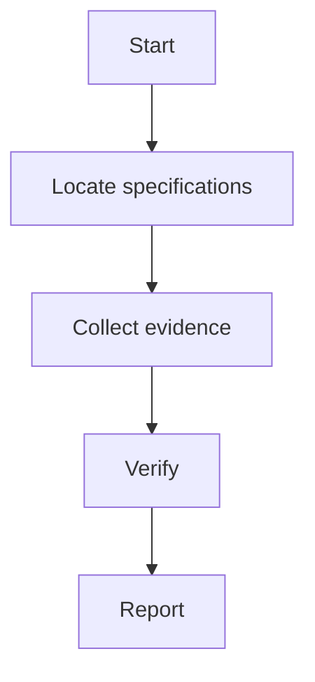

# 3GPP Research Kit 报告模板

# <研究主题> 深度研究报告

## 1. 结论摘要

用 5 到 8 条 bullet 总结核心结论。每条结论必须标注：

- `confirmed`
- `evidence-grounded`
- `inference`
- `needs_verification`

不要把解释性判断写成标准事实。

## 2. 研究范围与问题拆解

说明本次研究覆盖：

- 相关协议层
- 相关 TS/TR
- 相关 CR / TDoc / Meeting Report
- 涉及的 Release / Work Item
- 本次不覆盖的范围

## 3. 规范依据

| 功能 / 子问题 | 主要规范或资料 | 作用 | 证据状态 |
| --- | --- | --- | --- |
|  |  |  | needs_verification |

## 4. Evidence Table / 证据表

| id | claim | source_type | source_id | version_or_release | clause_or_section | evidence_summary | quote_or_pointer | status |
| --- | --- | --- | --- | --- | --- | --- | --- | --- |
| E001 |  |  |  |  |  |  |  | needs_verification |

## 5. 分阶段 / 分主题分析

### 5.1 <阶段或主题一>

- 输入条件：
- 核心过程：
- 输出状态：
- 相关规范：
- 证据编号：

### 5.2 <阶段或主题二>

- 输入条件：
- 核心过程：
- 输出状态：
- 相关规范：
- 证据编号：

## 6. 专利背景与痛点反推

本节只在问题涉及“功能为什么出现”“商业/工程痛点是什么”“某个 Feature 背后的实现动机是什么”时使用。

专利背景只能作为辅助材料，不能替代 3GPP 官方证据。来自 Google Patents / Espacenet / 专利文本的内容必须标注为 `auxiliary_background` 或 `inference`。

| feature / topic | patent source | assignee / inventor | background excerpt | inferred pain point | relation to 3GPP evidence | status |
| --- | --- | --- | --- | --- | --- | --- |
|  |  |  |  |  |  | auxiliary_background |

写作要求：

- 只摘取 `Background`、`Background Art`、`Technical Field` 或说明书中描述问题背景的段落。
- 明确区分“专利声称的背景问题”和“3GPP 已确认的标准设计动机”。
- 如果没有 CR/TDoc/Meeting Report 支撑，不能把专利背景写成 3GPP 官方动机。
- 推荐调用 `mcp/patent-mcp-server.py` 或外部 patent MCP 工具提取背景段落。

## 7. 对比矩阵

比较 4G/5G、release、规范、流程或方案时必须使用本节。

| axis | A evidence | B evidence | similarity | difference | status |
| --- | --- | --- | --- | --- | --- |

## 8. 图示

如适用，输出 Mermaid 图：

## 9. 常见误区和边界澄清

列出容易混淆的点，例如：

- 协议层边界
- Release 混淆
- 第三方解释与官方结论混淆
- TDoc 与 CR / TS / Meeting Report 层级混淆
- 专利背景与 3GPP 官方设计动机混淆
- Word 修订模式中删除内容与当前有效条文混淆

## 10. 未确认点与后续核验建议

| 未确认点 | 为什么未确认 | 后续应查 |
| --- | --- | --- |
|  |  |  |

## 11. 可复用总结

给出一版可直接写入技术文档、问题定位记录或分享文章的精简总结。
